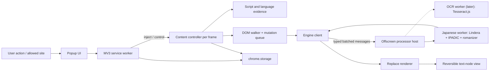
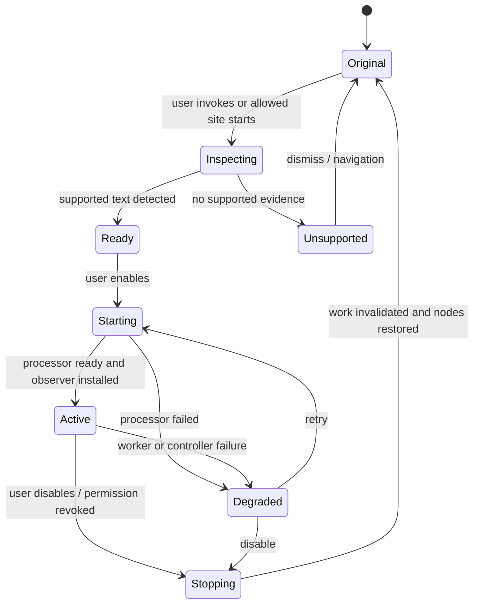
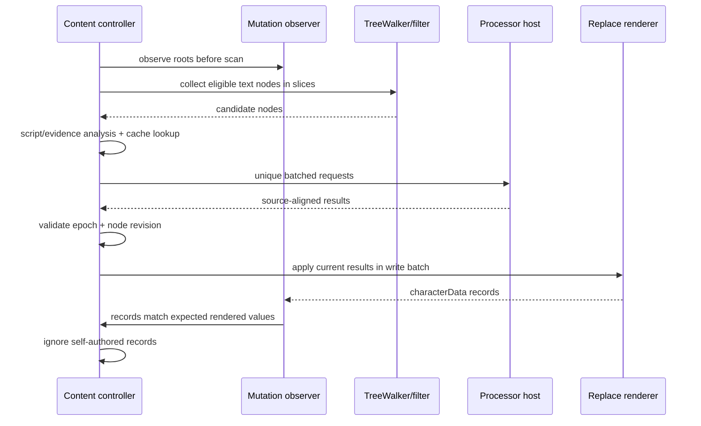

# Breaking the Barrier — Architecture

- **Document status:** Planning baseline 1.0
- **Last updated:** 2026-08-24
- **Target:** Chromium desktop, Manifest V3
- **Implementation status:** Not started

## 1. Repository audit

The current repository is a historical proof of concept, not a foundation to extend in place.

### 1.1 What exists

- `manifest.json` declares Manifest V3, `activeTab`, `scripting`, a persistent `<all_urls>` host permission, a popup, and a content script on all URLs.
- `popup.js` captures the visible tab and sends the base64 screenshot to `http://127.0.0.1:5000/convert`.
- `Back end/app.py` decodes the image, calls native Tesseract with Japanese language data, passes the recognized string to `pykakasi`, and returns one `romaji` string.
- `popup.html` displays the returned string in the popup.
- The current `content.js` is empty.
- There is no dependency manifest, setup guide, test suite, CORS configuration, positional OCR result, page overlay, settings storage, error boundary around `fetch`, or live DOM behavior.

### 1.2 What Git history adds

The initial commit accepted a JSON text field and used Python `romkan`. A later commit introduced screenshot OCR and `pykakasi`. An intermediate content script attempted to replace a hard-coded `.lyrics-selector`, but it was removed in the final prototype commit. The current prototype therefore demonstrates only this intended chain:

```text
manual popup click
    -> capture visible tab
    -> local Flask HTTP request
    -> native Japanese Tesseract OCR
    -> pykakasi
    -> unpositioned romaji in popup
```

It does not demonstrate changing page text, dynamic observation, restoration, or a working Spotify selector.

### 1.3 Ideas to preserve

- Local processing as an instinct.
- Japanese as the first language.
- Screenshot OCR as a separate way to reach pixel-only text.
- A user gesture before expensive capture.
- The original commits and files as historical evidence.

### 1.4 Decisions not to preserve

- OCR-first processing.
- A separately installed Python/Flask/native-Tesseract runtime.
- A broad persistent `<all_urls>` grant at installation.
- Returning one unpositioned OCR string to a popup.
- Site-specific selectors as the primary mechanism.
- Unstructured, destructive DOM replacement.

Phase 0 will move the existing prototype with Git history intact into `legacy/prototype-2024/` and add a short explanation. This planning task does not move or delete it.

## 2. Architectural goals

1. Make accessible DOM text the primary, fastest pipeline.
2. Remain correct on single-page applications and incremental DOM updates without periodic full-page rescans.
3. Make every page transformation reversible and resistant to stale asynchronous results.
4. Keep text, screenshots, dictionaries, and models local by default.
5. Separate script detection, language evidence, reading generation, romanization policy, and rendering.
6. Allow new language engines and renderers without changing DOM orchestration.
7. Load heavy assets only after a relevant user action.
8. Minimize browser permissions and avoid page-main-world code.
9. Degrade to untouched original content when any subsystem fails.
10. Make architectural claims testable through stable fixtures and explicit budgets.

## 3. Architectural principles

### DOM before pixels

If readable text exists in a text node, use it. OCR is slower, less accurate, less accessible, harder to position, and more privacy-sensitive.

### Source is authoritative

The webpage owns its DOM. Breaking the Barrier may render a temporary view but may not assume its value is the source. A newer page-authored write always wins.

### Incremental work

An initial scan is allowed once per root when a session starts. Afterward, process only added subtrees, changed text nodes, and explicitly invalidated roots.

### Local and bundled

All executable code, WASM, dictionaries, and OCR models ship with the extension. Page content never goes to a server in the selected architecture.

### Contracts around volatile dependencies

The DOM system depends on a Breaking the Barrier engine contract, not directly on Lindera, WanaKana, Tesseract.js, or a language-specific token schema.

### Conservative output

Script is not language. Han-only text is ambiguous. Unknown readings stay original rather than receiving a plausible-looking guess.

### Isolated execution

Content scripts run in the isolated extension world. Main-world injection, DOM API monkey-patching, and remote code are prohibited unless a later decision record changes this with evidence.

## 4. Selected system overview



The extension has two processing planes:

- The **page plane** lives in isolated content scripts. It discovers and owns temporary representations of page text.
- The **processor plane** lives in one extension offscreen document and its workers. It owns heavyweight language and OCR state shared across frames and tabs.

The service worker is a coordinator, not the long-running language processor. It manages permissions, injection, tab/session state, capture, offscreen lifecycle, and extension UI messages.

## 5. Extension contexts and responsibilities

### 5.1 Popup

- Displays status for the current tab.
- Starts a lightweight page inspection after a user gesture.
- Confirms Japanese detection and enables or disables Live Mode.
- Offers “remember for this site,” which requests only the current HTTP(S) origin as an optional host permission.
- Displays retryable, restricted-page, loading, partial-failure, and original states.
- Does not tokenize, scan DOM, or hold authoritative tab state.
- Uses vanilla HTML, CSS, and TypeScript; no UI framework.

### 5.2 Service worker

- Registers browser event listeners synchronously at module startup.
- Validates popup and content messages.
- Injects the compiled content bundle and CSS with `chrome.scripting` after `activeTab` or origin permission is available.
- Reconciles persistent programmatic content-script registrations with per-site policy.
- Ensures one offscreen processor document exists before heavy engine work.
- Tracks ephemeral sessions in `chrome.storage.session`, not only in globals that disappear on suspension.
- Captures the visible tab for Lens and Spotlight after a user gesture.
- Tracks tab closure/navigation and asks active frames to stop when appropriate.
- Does not store page text or screenshots.

### 5.3 Content controller

Each injected frame creates one idempotent controller. Re-injection returns the existing controller rather than adding another observer.

Responsibilities:

- Maintain the frame session state machine.
- Discover document and supported open-shadow roots.
- Collect eligible text nodes.
- Build document and inherited-language evidence.
- Batch engine requests and reject stale responses.
- Apply and restore renderer state.
- Observe DOM mutations while active.
- Mount extension-owned page UI in a marked Shadow DOM root in the top frame only.
- Report metadata-only health and counts to extension UI.

The content controller never sends HTML, element objects, whole-page `textContent`, or screenshots to the service worker. It sends bounded text fragments to the local processor host only.

### 5.4 Offscreen processor host

- Is a static bundled extension page created with the `WORKERS` reason.
- Receives only versioned messages targeted at the processor.
- Starts a Japanese worker lazily and reuses it across requests.
- Starts the OCR worker only for Lens/Spotlight.
- Owns shared in-memory LRU caches and in-flight request coalescing.
- Can be closed when there are no enabled sessions or active OCR jobs and the named idle policy expires.
- Exposes no external web connection and does not render user-visible UI.

Chrome permits only one offscreen document per installed extension profile, so Japanese and OCR workers share this host and have independent lifecycle controllers.

### 5.5 Japanese worker

- Loads the bundled Lindera WASM module and packaged IPADIC files.
- Maps pinned IPADIC token details into an internal typed token representation.
- Selects pronunciation/reading safely.
- Converts Kana to the product's ASCII Hepburn representation.
- Applies Japanese spacing and grammatical-particle policy.
- Returns source-aligned segments and warnings.
- Never accesses the page DOM or browser extension APIs.

### 5.6 OCR worker

**Later scope.** It loads bundled Tesseract.js, WASM core, and Japanese trained data on first Lens invocation. It returns recognized line/word boxes. OCR output then passes through the same detector and Japanese engine contract used by Live Mode.

## 6. Lifecycle

### 6.1 Frame session state machine



Every transition that starts work increments a `sessionEpoch`. Asynchronous results carry that epoch and the node revision. Results from a prior epoch are discarded.

### 6.2 First use on a new site

1. Opening the popup is a browser-recognized user invocation and grants temporary `activeTab` access.
2. The user chooses Inspect or Romanize.
3. The service worker injects the lightweight content bundle in the main frame.
4. The content controller samples eligible candidates without loading the Japanese dictionary.
5. If Japanese evidence is present, the popup and optional in-page chip show “Japanese detected.”
6. On confirmation, the service worker ensures the processor host exists.
7. The content controller installs its observer before the initial scan, then batches Japanese work.
8. Replace Mode applies current results.

The extension cannot proactively detect Japanese on a site it has never been allowed to inspect. The product must not imply otherwise.

### 6.3 Remembered site

1. In a popup user gesture, the extension explains and requests only the current origin through `chrome.permissions.request`.
2. If granted, the service worker stores a site policy and registers a persistent content script for that origin.
3. On later documents at that origin, the lightweight controller may detect text and prompt automatically according to the stored ask/always setting.
4. Revoking the policy unregisters the script and removes the optional origin permission.

Programmatic registrations are reconciled from storage on install, startup, and permission changes. Registration IDs are deterministic hashes of normalized origins; they never contain page paths or content.

### 6.4 Navigation

- Same-document and SPA navigation keep the controller alive. Added/replaced nodes flow through the observer.
- A full document navigation destroys the old content context, so its DOM modifications disappear with the document.
- A remembered origin receives a fresh controller automatically.
- A temporary `activeTab` session may require another user invocation after a cross-origin navigation.
- `pagehide` invalidates requests and performs best-effort cleanup; correctness does not depend on cleanup running because the document is being discarded.

### 6.5 Stop and restoration

1. Set the session to Stopping and increment `sessionEpoch`.
2. Disconnect observers and stop accepting new candidates.
3. Cancel or logically invalidate pending batches.
4. For each active transformed node, restore only if its current value equals the extension's last rendered value.
5. If the current value differs, treat it as a newer page-authored value and leave it untouched.
6. Clear active sets, transient UI, and per-frame cache.
7. Notify the service worker that the frame no longer needs the processor.

## 7. Typed message architecture

All messages use a discriminated union with:

- `protocolVersion`;
- `type`;
- `requestId` where a response is expected;
- `sessionId` and `sessionEpoch` for page work;
- bounded payload fields;
- a target context such as `serviceWorker`, `content`, or `processor`.

Representative message families:

- `session.inspect`, `session.start`, `session.stop`, `session.status`;
- `processor.ensure`, `processor.release`;
- `transliteration.batch.request`, `transliteration.batch.response`;
- `lens.capture.request`, `lens.ocr.request`, `lens.result`;
- `preferences.get`, `preferences.patch`, `preferences.changed`;
- `health.error`, containing an error code and safe metadata but no source text.

Batch items use an opaque item ID and contain only the necessary text, engine/options key, and bounded language context. Processor responses echo item IDs. DOM nodes never cross a context boundary.

Runtime message handlers must:

- validate shape at the boundary;
- reject unknown protocol versions and message types;
- verify expected sender context, tab ID, and frame ID where available;
- enforce maximum item count and UTF-16/code-point length before processing;
- always resolve with a typed success or error response;
- never log the raw invalid payload.

The exact limits live in named shared configuration and are tuned by tests, not copied as unexplained literals.

## 8. Script detection and language evidence

Script detection and language selection are separate pure modules.

### 8.1 Script detector

`ScriptDetector.analyze(text)` returns ordered runs with source offsets and counts for at least:

- Hiragana;
- Katakana, including half-width forms after non-destructive analysis normalization;
- Han;
- Latin;
- Common/Inherited characters such as punctuation, digits, emoji, and combining marks;
- other named script groups as future engines require.

Use Unicode property escapes where the target runtime supports them, wrapped by tested helpers. Detection must preserve original offsets; any normalization used for analysis must not silently replace the source string.

Fast prechecks answer whether a string contains a script of interest before any language engine or computed-style work.

### 8.2 Language evidence

`LanguageEvidenceResolver` combines:

1. an explicit user-selected language;
2. the nearest inherited `lang` attribute on the element;
3. `document.documentElement.lang`;
4. script combinations in the text, especially Kana plus Han;
5. bounded document-level evidence sampled from candidate nodes;
6. engine-specific support assessment.

Confidence is categorical, not a fabricated probability:

- `explicit`;
- `strong`;
- `probable`;
- `ambiguous`;
- `unsupported`.

Japanese V1 rules:

- Kana is strong Japanese evidence.
- Han plus Kana in the same or nearby language context is strong or probable.
- `lang="ja"` permits Han-only text to reach the Japanese engine.
- Han-only text without Japanese context is ambiguous and remains unchanged by default.
- Mixed Latin/Japanese text is processed by source-aligned runs, not rejected as a whole.

Page-level detection used for the prompt reports the supported language only after a named threshold of candidate evidence. The threshold is configuration with corpus tests.

## 9. Transliteration engine contract

The original conceptual `canHandle(text)` interface is too small because it conflates script, language, context, engine readiness, and output shape. The implementation contract should be equivalent to:

```ts
interface TransliterationEngine {
  readonly metadata: EngineMetadata;
  load(signal?: AbortSignal): Promise<void>;
  assess(request: SupportRequest): SupportDecision;
  transliterate(
    requests: readonly TransliterationRequest[],
    signal?: AbortSignal,
  ): Promise<readonly TransliterationResult[]>;
  dispose(): Promise<void>;
}
```

`EngineMetadata` includes:

- stable engine ID and implementation version;
- language and script capabilities;
- available output schemes;
- dictionary/model version;
- whether token offsets and readings are available.

`TransliterationRequest` includes:

- opaque item ID;
- original source;
- script analysis;
- language evidence;
- requested scheme and formatting policy.

`TransliterationResult` includes:

- item ID and unchanged source;
- final rendered text;
- source-aligned segments with `start`, `end`, `source`, `reading`, and `romanized` where known;
- engine, dictionary, and policy versions;
- structured warnings such as `unknown-reading`, `ambiguous-language`, or `partial-output`.

It does not include a numeric language or reading confidence unless the underlying system produces a calibrated value. OCR confidence stays an OCR field and is not repurposed as linguistic confidence.

An `EngineRegistry` selects engines from language evidence. A `FormattingPolicy` turns token readings into a display string. A `Renderer` consumes results. These interfaces prevent a second language or a new renderer from importing Japanese internals.

## 10. Japanese V1 engine

### 10.1 Selected dependency direction

The selected Phase 0 candidate is:

- Lindera WASM's bundler build from the actively maintained Lindera 5.x line;
- the matching IPADIC release files, packaged inside the extension;
- WanaKana 5.x for Kana-to-romaji primitives behind the product's own tested romanization policy.

As of this document, Lindera 5.1.0 was released on 2026-08-10 and its packaged IPADIC archive is approximately 15.1 MiB. The repository is MIT-licensed; the dictionary's notices and redistribution terms must be preserved under `third_party/licenses/`. WanaKana 5.3.1 is MIT-licensed.

These become approved production dependencies only after the Phase 0 gate proves:

- Manifest V3 and `wasm-unsafe-eval` compatibility;
- successful worker loading from a bundled extension with no network;
- deterministic output on the golden corpus;
- acceptable compressed package size, startup time, warm latency, and memory;
- correct dictionary notices and reproducible asset provenance;
- no unsafe dynamic code or remote asset fallback.

If the gate fails, the engine contract remains unchanged while the dependency decision is reopened.

### 10.2 Build-time dictionary handling

The dictionary must not be downloaded at extension runtime.

Phase 0 introduces a reproducible asset script that:

1. downloads an explicitly pinned official Lindera IPADIC release during development or release preparation;
2. verifies a committed SHA-256 from the official release;
3. extracts only the required runtime files into the build assets;
4. records source URL, version, checksum, and license notices;
5. fails the build when expected files or checksums differ.

Release artifacts include the required dictionary files. The offscreen worker resolves them through extension URLs and passes bytes to Lindera's dictionary loader. No CDN, GitHub request, OPFS bootstrap download, or native binary is required after installation.

Generated dictionary assets need not be committed if the build is reproducible and CI/release environments can fetch the pinned artifact. The release process must still support an offline verification build from a prepared cache.

### 10.3 Token mapping

Only `JapaneseLinderaAdapter` knows the pinned IPADIC detail schema. It maps raw tokens to:

- source surface and byte/code-point offsets;
- coarse and detailed part of speech;
- base form;
- reading;
- pronunciation;
- known versus out-of-vocabulary state.

The adapter uses the pronunciation field when valid, then reading, then a Kana source fallback. A Han-bearing token without a valid reading is marked unknown and kept original. Schema positions are named constants with fixture tests; they may not leak into renderers or generic engine code.

Byte offsets from WASM must be converted to JavaScript string offsets through a tested mapper because JavaScript uses UTF-16 code units and Japanese strings may contain supplementary characters or emoji.

### 10.4 ASCII Hepburn policy

The product default is a versioned `ascii-hepburn-v1` policy:

- familiar Hepburn consonants such as `shi`, `chi`, and `tsu`;
- lowercase by default while preserving untouched Latin source casing;
- long vowels represented as written vowel sequences, for example `toukyou`, not macrons;
- grammatical particles rendered by pronunciation when reliable POS evidence exists: は as `wa`, へ as `e`, and を as `o`;
- sokuon, syllabic `n`, apostrophe/disambiguation, prolonged sound mark, punctuation, and mixed Latin behavior fixed by golden tests;
- no translation, gloss, or meaning lookup.

WanaKana is an implementation aid, not the product specification. Product tests define observable output and shield the application from dependency behavior changes.

### 10.5 Spacing policy

Blindly inserting spaces between all morphological tokens would produce unnatural output such as splitting an auxiliary from its verb. `JapaneseSpacingPolicy` uses token boundaries and POS to create readable groups:

- particles generally form separate readable words;
- auxiliary verbs and inflectional endings attach to their host;
- punctuation follows source spacing rules;
- existing Latin/number spacing is preserved;
- proper-noun and compound behavior is corpus-tested;
- the output example `星座になれたら` targets `seiza ni naretara`.

Spacing rules are versioned independently from the dictionary so caches invalidate when presentation changes.

### 10.6 Why not Kuroshiro/Kuromoji as the default

Kuroshiro has a convenient browser API and built-in romanization, but its latest npm release is about five years old. Its Kuromoji analyzer and Kuromoji dependency were last published about eight years ago, and the Kuromoji package is roughly 39 MiB unpacked with about 18 MiB of compressed dictionary files. It remains a useful benchmark and fallback candidate, not the selected starting point.

`pykakasi` remains valuable as an offline comparison oracle during corpus construction, but using it in production would retain the Python/server installation burden.

## 11. Initial DOM processing pipeline



### 11.1 Root registry

The traversal abstraction accepts `Document` and, later, accessible `ShadowRoot` objects. Each root has:

- one scanner;
- one observer or observer registration;
- a root ID used only inside the frame;
- teardown logic.

The document root is MVP. Open Shadow DOM support reuses the same pipeline in Phase 4; closed roots are inaccessible.

### 11.2 Tree walking

Use `document.createTreeWalker(root, NodeFilter.SHOW_TEXT, filter)`. Do not serialize HTML, replace `innerHTML`, or recursively concatenate whole subtrees.

Collection runs in bounded slices through a scheduler abstraction. `requestIdleCallback` may be used in Chromium when available, with a tested `setTimeout`/message-channel fallback and a deadline budget. The observer is installed before collection so page changes during the scan are not lost.

### 11.3 Eligibility filter

The filter rejects a text node when any of the following is true:

- empty or whitespace-only;
- disconnected;
- no supported script precheck match;
- inside `SCRIPT`, `STYLE`, `NOSCRIPT`, `TEMPLATE`, `CODE`, `PRE`, `KBD`, `SAMP`, `TEXTAREA`, `INPUT`, `SELECT`, or contenteditable content;
- inside extension-owned UI or an element marked `data-btb-ignore`;
- inside SVG or MathML for the MVP;
- inside a semantically hidden or inert subtree;
- within an unsupported frame/root.

Visibility policy is layered to avoid layout thrashing:

1. structural and semantic checks first;
2. script precheck second;
3. a memoized computed-style check on the nearest element only for remaining candidates;
4. no per-node `Range.getClientRects()` in normal scanning.

Class-driven visibility changes that do not alter text are an explicit Phase 0/2 measurement question. The observer must not watch every attribute by default unless evidence shows that a bounded attribute strategy is affordable.

### 11.4 Read/write separation

DOM reads, engine messages, and DOM writes occur in separate stages. A write queue applies a bounded batch together and does not interleave computed-style reads. This reduces forced layout and makes mutation ownership predictable.

## 12. Dynamic mutation pipeline

The observer subscribes to `childList`, `characterData`, and `subtree` on each active root. A narrow attribute filter may later include `lang`, `hidden`, and `aria-hidden`; `class` and `style` are not observed globally without performance evidence.

The callback performs no language-engine work. It:

1. examines records inside a per-record error boundary;
2. adds changed text nodes and roots of newly added subtrees to deduplicating sets;
3. records removed subtrees for active-node cleanup;
4. schedules one drain if none is scheduled.

The drain:

1. cleans removed active nodes without walking unrelated page areas;
2. expands only newly added subtrees with a `TreeWalker`;
3. resolves changed text-node ownership;
4. filters and snapshots current source values;
5. increments node revisions for page-authored changes;
6. groups cache misses into bounded unique-string batches;
7. applies current responses in a write slice.

No timer periodically rescans the whole page. A diagnostic/manual rescan command may exist for development and recovery, but it is not the steady-state algorithm.

## 13. Node state, self-mutation prevention, and restoration

### 13.1 State model

Use a `WeakMap<Text, NodeState>` for lookup and a carefully maintained `Set<Text>` for currently transformed nodes because WeakMaps cannot be iterated during restoration.

`NodeState` contains at least:

- `source`: latest known page-authored value;
- `rendered`: last value written by the active renderer;
- `revision`: incremented for each new source snapshot;
- `sessionEpoch`;
- `rendererId` and options key;
- `status`: queued, processing, rendered, failed, or restoring.

The active set is pruned when nodes are removed, restored, found disconnected during idle cleanup, or the session ends. This prevents detached-node retention.

### 13.2 Identifying self-authored mutations

Immediately before a write, set `state.rendered` and renderer ownership, then assign `node.data`.

When a character-data record arrives:

- if `node.data === state.rendered`, it is the expected current extension view and needs no new work;
- otherwise the page or another actor has written a new value, which becomes `state.source`, increments `revision`, and is processed;
- if multiple writes race before the observer callback, the current node value is authoritative and older queued results fail revision validation.

Do not disconnect/reconnect the observer around every write. That creates race windows and unnecessary work. Expected-value ownership is the primary guard.

### 13.3 Applying asynchronous results

A result is applied only when:

- the frame session is Active;
- the session epoch matches;
- the node is connected to the observed root;
- its revision matches the request snapshot;
- its current value still equals the expected source or currently owned rendered value for that revision;
- the renderer and options key still match.

Otherwise the result is discarded. Discarding stale work is normal, not an error.

### 13.4 Exact restoration

On stop:

- if the node still contains `state.rendered`, write `state.source`;
- if it contains something else, do not overwrite it;
- clear ownership either way.

This returns the exact latest original for extension-owned content while respecting a newer framework write. “Exact” means exact JavaScript string data, including whitespace and punctuation; no normalization is written back to source.

## 14. Renderer architecture

```ts
interface Renderer {
  readonly id: string;
  apply(target: Text, result: TransliterationResult, context: RenderContext): RenderHandle;
  restore(handle: RenderHandle): void;
  dispose(): void;
}
```

The generic controller owns source revisions. Renderers own how a result appears.

### Replace renderer — MVP

- Assigns `Text.data` only.
- Does not insert wrappers or replace parent elements.
- Does not alter attributes, event listeners, selection handlers, or framework component trees.
- Is most resistant to layout and React ownership problems, though wider Latin strings can still wrap or clip.

### Hover renderer — later

- Leaves text unchanged.
- Uses pointer and focus delegation from a marked extension overlay root.
- Positions an accessible tooltip from a range bounding box on demand.
- Requires mapping nodes to cached results without wrapping every node.

### Learning renderer — later/experimental

- May create ruby or annotated wrapper structures.
- Must restore the exact original text node and selection behavior.
- Requires dedicated layout, copy/paste, screen-reader, React-rerender, and nested-inline tests.
- Is not enabled merely because the engine returns token segments.

### OCR overlay renderer — later

- Uses fixed viewport coordinates matching the captured image.
- Never pretends to be DOM text replacement.
- Is invalidated on movement or geometry changes.

## 15. Caching and scheduling

### 15.1 Cache keys

A transliteration cache key includes:

- exact source string or a collision-resistant keyed representation held only in memory;
- engine ID and implementation version;
- dictionary version;
- romanization policy version;
- spacing/output options;
- language context flags that can affect the reading.

Whitespace is preserved in results. If a trimmed core is cached, leading/trailing source whitespace is removed and reattached through a tested reversible function.

### 15.2 Cache layers

- A small per-frame cache avoids messages for recent repeated labels and keeps renderer-specific formatting close to the page.
- A larger bounded processor LRU shares language results across frames and tabs.
- An in-flight map coalesces identical concurrent misses.
- OCR image/results are not added to the transliteration LRU and are released after overlay construction.
- No page-derived cache is persisted to disk.

Capacity is named configuration. Phase 2 stress tests tune it from hit rate and memory measurements.

### 15.3 Work priorities

1. Stop/restoration and stale-work invalidation.
2. User-visible changed nodes.
3. Initial visible candidate batches.
4. Lower-priority added subtrees.
5. cleanup and cache pruning.

The initial scanner may use viewport-aware prioritization later, but correctness must not depend on `IntersectionObserver`.

## 16. Frames and Shadow DOM

### 16.1 Iframes

- Each authorized frame runs an independent controller and restoration registry.
- The top frame owns page prompts and Lens overlays.
- Same-origin frames can be targeted when the current permission permits.
- Cross-origin frames require their own matching optional host permission; otherwise they are skipped.
- Sandboxed, inaccessible, or restricted frames are reported as a nonfatal coverage limitation.
- Frame text is never proxied through page scripts.

Initial activation may target only the main frame. All-frame behavior is added after restoration and permission tests prove it safe.

### 16.2 Shadow DOM

- Open Shadow roots can reuse `RootRegistry`, `TreeWalker`, and observer logic.
- The document observer does not see mutations inside a shadow root, so each discovered root needs its own observation registration.
- Newly upgraded custom elements and roots attached after host insertion need an experimental discovery strategy.
- Closed roots remain unsupported.
- The extension will not patch `Element.prototype.attachShadow` in the main world for MVP coverage.

The extension's own in-page UI uses an open Shadow root for style isolation and testing, with a host marker that the DOM filter rejects.

## 17. Preferences and storage

Use `chrome.storage.local` for versioned preferences and granted-site policy metadata. Use `chrome.storage.session` for ephemeral service-worker recovery state. Do not use page `localStorage`.

### 17.1 Persistent schema

The schema contains:

- `schemaVersion`;
- global enabled default;
- per-language enabled flags and output policy;
- renderer default, fixed to Replace in MVP UI;
- per-origin policy: ask, always, or disabled;
- onboarding/permission explanation state;
- later Lens and Spotlight preferences.

It does not contain:

- page text;
- OCR images or results;
- visited page paths or titles;
- transliteration cache entries;
- DOM identifiers;
- analytics events.

Origin keys are normalized by a single utility. Migrations are pure, sequential, idempotent, and fixture-tested. Storage changes publish typed preference events to active controllers.

`storage.sync` is not selected for MVP. It would send settings through browser sync and complicate the local-only trust story without being necessary. It may be reconsidered as an explicit opt-in later.

## 18. Lens / OCR architecture

Lens is a separate post-MVP feature and does not alter the Live Mode contracts.

```mermaid
sequenceDiagram
    participant U as User
    participant C as Content overlay
    participant S as Service worker
    participant H as Offscreen host
    participant O as OCR worker
    participant J as Japanese engine

    U->>C: choose Lens and drag region
    C->>C: hide extension overlays for capture
    C->>S: capture request + CSS viewport geometry
    S->>S: captureVisibleTab
    S->>H: image + selected region + geometry
    H->>H: decode and crop pixels
    H->>O: cropped bitmap
    O-->>H: lines/words + boxes + OCR confidence
    H->>J: recognized Japanese strings
    J-->>H: romanized segments
    H-->>C: normalized positioned results
    C->>C: render fixed overlay; invalidate on movement
```

### 18.1 Capture

- `chrome.tabs.captureVisibleTab` runs in the service worker or extension page after a user gesture and uses `activeTab`.
- The API captures the visible viewport, not an arbitrary hidden full page.
- Content provides `visualViewport`, scroll, zoom-related CSS geometry, selection rectangle, and device pixel ratio hints.
- The host compares actual screenshot dimensions with CSS viewport dimensions to derive scale; it does not trust device pixel ratio alone.
- Extension overlays are temporarily hidden for one animation frame before capture and restored immediately afterward.

### 18.2 OCR dependency direction

Tesseract.js 7.x is the primary Phase 5 candidate because it runs in a browser worker, supports Japanese trained data, worker reuse, region recognition, and structured blocks when non-text outputs are enabled. It is Apache-2.0 licensed and actively maintained.

It is not an approved MVP dependency and must not be installed in Phase 0. Phase 5 begins with an accuracy, package-size, memory, latency, MV3 worker/CSP, positional-output, and license spike. The trained data and WASM core must be bundled; CDN examples are not acceptable in the extension.

Native Tesseract plus Flask is rejected because it requires external installation and IPC. Browser `TextDetector` or other shape-detection APIs are not selected because availability, Japanese quality, and positional behavior are not portable or reliable enough to be the sole architecture.

### 18.3 Normalized OCR result

The internal result contains:

```ts
interface OcrRegion {
  original: string;
  romanized: string;
  box: { x: number; y: number; width: number; height: number };
  coordinateSpace: "captured-region-css-px";
  ocrConfidence?: number;
  readingWarnings: readonly string[];
}
```

Coordinates are normalized to the captured CSS viewport or selected-region coordinate space before reaching the renderer. OCR confidence describes recognition only; it does not imply the Japanese reading is correct.

### 18.4 Overlay validity

The overlay is a top-frame, extension-owned fixed layer. Results are tied to a capture ID and geometry snapshot. Scroll, resize, zoom, SPA navigation, video seek/play, or an explicit refresh invalidates them. Phase 5 may later support anchored image elements, but stale boxes must never float over unrelated content.

## 19. Spotlight architecture

Spotlight reuses capture, crop, OCR, Japanese engine, and overlay contracts. It adds a pointer state machine:

```text
inactive -> armed -> pointer moving -> stationary debounce
         -> capture pending -> OCR pending -> result shown
         -> moving/cancelled/stale
```

Constraints:

- Explicit mode entry and visible cursor treatment.
- Pointer events are sampled, not used to trigger a capture per event.
- Capture begins only after the pointer remains within a small tolerance for a named debounce interval.
- At most one job is active; movement cancels or invalidates it.
- The full screenshot capture rate stays below Chrome's maximum of two calls per second and should target materially less in normal use.
- Only a small crop around the pointer reaches OCR.
- Scrolling, clicking, Escape, tab blur, and mode exit remove the result.
- Protected video, fast animation, and constantly changing pixels may be unavailable.

`captureVisibleTab` is expensive even when the final crop is small. `tabCapture` or display-media streams would add permission, indicators, lifecycle, and privacy complexity. They are rejected for Spotlight unless the capture spike proves deliberate screenshots unusable.

## 20. Service-worker and processor recovery

Manifest V3 service workers are disposable. The design may not rely on global memory surviving.

- Event listeners register at module evaluation.
- Persistent preferences live in `storage.local`.
- Active session metadata and processor refcounts live in `storage.session` and are reconciled with actual runtime contexts.
- `chrome.runtime.getContexts` or the supported offscreen existence check prevents duplicate document creation; a module-level creation promise only deduplicates concurrent calls during one worker lifetime.
- Content controllers can reissue `processor.ensure` idempotently.
- A processor worker failure rejects current items, clears its readiness promise, and permits one bounded restart attempt.
- Repeated failure opens a circuit for the session, leaves source text original, and surfaces a safe retry state.

Closing the processor is an optimization, not a correctness requirement. A named idle policy closes it only when no enabled frame or OCR job is known. Reconciliation after a service-worker restart favors keeping a possibly needed processor over interrupting active page work.

## 21. Permission strategy

### Required for the Live Mode MVP

- `activeTab`: temporary current-tab access after user invocation.
- `scripting`: programmatic content and CSS injection.
- `storage`: versioned preferences and ephemeral recovery state.
- `offscreen`: reusable worker host.

### Declared optional host patterns

- `https://*/*` and `http://*/*` only under `optional_host_permissions`, so the extension can request one concrete origin when a user selects “remember for this site.”

### Not required

- No persistent `<all_urls>` host permission.
- No `tabs` permission solely to use the `tabs` namespace; `activeTab` covers sensitive current-tab operations after invocation.
- No cookies, history, webRequest, debugger, nativeMessaging, clipboard, microphone, camera, or broad network permissions.

Lens can use `captureVisibleTab` through `activeTab`; it should not add `<all_urls>`.

The minimum Chromium version starts at 109 for offscreen support. Phase 0 confirms WASM and API requirements and records the final minimum in the manifest.

## 22. Security and privacy architecture

### Trust boundaries

- The webpage and every DOM value are untrusted.
- The content script is privileged relative to the page but has the narrowest possible browser API surface.
- Runtime messages are untrusted until schema and sender validation pass.
- Dictionary/model files are trusted only after pinned checksum verification in the release process.
- Third-party library output is validated before it reaches DOM writes.

### Controls

- Isolated-world content scripts only.
- No `externally_connectable` manifest entry.
- No remote executable code or runtime model/dictionary download.
- WASM enabled only for extension pages with the minimum CSP directive `script-src 'self' 'wasm-unsafe-eval'; object-src 'self'`.
- No inline scripts, `eval`, dynamically constructed functions, or page-provided code.
- Per-message length and batch limits; per-capture dimension and byte limits.
- Text writes use `Text.data`, never HTML parsing.
- Extension UI text uses safe text properties, not page-derived HTML.
- Development logs use error codes, counts, timings, engine versions, and coarse origin permission state; raw content logging requires a deliberate local debug build and is never enabled in release.
- Screenshots, ImageBitmaps, canvases, and object URLs are closed, cleared, or revoked promptly.
- In-memory caches are dropped when the host closes; no browsing content is persisted.

The extension privacy disclosure must plainly explain that granted pages can be read and changed locally, and that Lens captures visible pixels only when invoked.

## 23. Error boundaries and degradation

Define a typed `BtbError` with safe fields:

- code;
- subsystem;
- severity;
- retryable flag;
- safe cause category;
- optional request/session IDs;
- never raw page content.

Boundaries exist at:

- each mutation record;
- each node eligibility evaluation;
- each batch item;
- each engine load and worker message;
- each renderer apply/restore;
- storage reads/migrations;
- permission and injection operations;
- capture, decode, OCR, and overlay mapping.

Degradation rules:

- Unsupported/ambiguous language: leave source unchanged.
- One transliteration failure: leave that node source unchanged and continue the batch.
- Japanese worker unavailable: keep or restore original, show retryable degraded status.
- OCR unavailable: disable Lens result only; Live Mode continues.
- Popup closed: content session continues according to current state.
- Service worker suspended: content controller continues observing; it re-establishes processor coordination idempotently when needed.
- Renderer exception: stop applying to that node and preserve/restore source; do not replace parent content.

## 24. Testing architecture

### 24.1 Unit tests

- Unicode script runs and mixed-script offsets.
- Language evidence, including ambiguous Han-only cases.
- IPADIC token mapping and byte-to-UTF-16 offsets.
- ASCII Hepburn and Japanese spacing golden cases.
- Engine registry and versioned cache keys.
- LRU bounds and in-flight coalescing.
- Preference migrations and origin normalization.
- Typed message validation and size limits.
- OCR coordinate transforms as pure geometry functions.

### 24.2 DOM tests

Use Vitest with jsdom for deterministic controller behavior:

- static text and nested elements;
- mixed English/Japanese text;
- excluded tags and extension UI;
- added subtrees and changed character data;
- duplicate mutation records;
- self-authored observer records;
- same-node framework overwrite;
- framework node replacement;
- stale asynchronous response after a second change;
- toggle-off during in-flight work;
- exact restoration and newer-page-write preservation;
- removed-node cleanup;
- one-node exceptions that do not stop later nodes.

Do not assume jsdom models layout, extension APIs, WASM workers, or Chromium mutation timing exactly.

### 24.3 Browser integration tests

Use Playwright with a loaded unpacked Chromium extension and local fixture server:

- static article fixture;
- Spotify-like changing title/artist/lyric fixture;
- YouTube-like history navigation and lazy comments fixture;
- React fixture that updates and replaces owned nodes;
- 5,000-node large-page fixture;
- frequent-mutation stress fixture;
- same-origin iframe and inaccessible-frame fixture;
- permission and remembered-origin flows;
- popup, page chip, keyboard, and reduced-motion behavior;
- offline startup proving all code/dictionary assets are packaged;
- network inspection proving no content upload.

Real Spotify and YouTube smoke tests are manual or separately maintained because production DOM and authentication are unstable. Generic fixtures remain the release gate unless the product owner makes real sites contractual acceptance targets.

### 24.4 Japanese quality corpus

Version a licensed/owned corpus with expected source, reading, romanized output, category, and rationale. Include:

- Kana-only deterministic strings;
- common Kanji vocabulary in sentences;
- song/video titles and artist-style proper nouns;
- particles and inflections;
- numbers, Latin words, punctuation, emoji, and whitespace;
- ambiguous and unknown terms expected to remain original;
- regressions from reported bugs.

Report overall exact output and separate name/unknown categories. Never tune solely to the motivating examples.

### 24.5 Performance and memory

Instrument development builds with content-free counters and `performance.mark`:

- scan candidate count and slice duration;
- mutation records, unique affected nodes, batches, cache hit rate;
- engine cold readiness, warm latency, and queue depth;
- renderer write duration;
- processor memory where the browser exposes useful measurement;
- detached-node growth across repeated replacement/navigation.

Budgets come from `PRD.md`. Performance tests use fixed fixtures and an identified reference device/profile.

### 24.6 OCR tests — later

- Owned Japanese image fixtures with expected text and bounding-box tolerances.
- Multiple font sizes, contrast, vertical text, scale, crop, and rotation cases.
- CSS-to-pixel coordinate mapping at zoom and device scale variants.
- scroll/resize invalidation.
- blank/protected-like result behavior.
- worker reuse and cancellation.

### 24.7 Accessibility tests

- Automated axe checks for popup and injected UI.
- Keyboard-only start, stop, permission explanation, Lens selection, and dismissal.
- Screen-reader checks for page prompt and later annotation/hover modes.
- High contrast, 200% zoom, and reduced motion.

## 25. Technical stack and build tooling

### Runtime

- TypeScript in strict mode.
- Chromium Manifest V3.
- Native DOM APIs: `TreeWalker`, `MutationObserver`, `WeakMap`, and standard workers.
- `chrome.scripting`, `chrome.storage`, `chrome.permissions`, `chrome.offscreen`, runtime messaging, and `captureVisibleTab` when Lens arrives.
- Lindera WASM plus packaged IPADIC and the product Japanese adapter after Phase 0 approval.
- WanaKana behind the ASCII Hepburn policy after Phase 0 approval.
- Tesseract.js only after the Phase 5 gate.

### UI

- Semantic HTML, CSS custom properties, and vanilla TypeScript.
- Native controls where possible.
- Small inline or bundled SVG icons with text alternatives where required.
- No React, Vue, component system, router, or CSS-in-JS dependency.

### Build and quality

- npm with a committed lockfile.
- Vite for multi-entry extension HTML, worker, WASM, and asset builds without an extension framework plugin.
- `tsc --noEmit` for strict type checking.
- Vitest for unit and jsdom tests.
- Playwright for Chromium extension integration.
- ESLint with typescript-eslint for static rules.
- A small reviewed build script copies/validates the manifest and pinned assets; it must not become a second framework.

Vite is selected over a hand-built esbuild pipeline because the chosen WASM/worker path has documented Vite/bundler support and the project has multiple HTML/worker entries. Plasmo, WXT, and CRX framework plugins are not selected because the extension does not need their runtime abstractions and they would make permissions, emitted scripts, and worker assets less explicit.

Use a small `platform/` adapter for browser APIs and promises. Do not add `webextension-polyfill` in the Chromium MVP unless the Firefox phase demonstrates it removes more code than it adds.

All versions are pinned by the Phase 0 lockfile after compatibility checks. Documentation names release lines, not speculative version ranges that have not been installed and tested.

## 26. Proposed repository structure

```text
/
├── PRD.md
├── Architecture.md
├── Rules.md
├── Phases.md
├── Design.md
├── Memory.md                    # created only when implementation begins
├── package.json
├── package-lock.json
├── tsconfig.json
├── vite.config.ts
├── manifest.json                # modern source/static manifest
├── src/
│   ├── background/
│   │   ├── service-worker.ts    # browser events, injection, permissions, capture
│   │   ├── registrations.ts     # remembered-site content registrations
│   │   └── processor-life.ts    # offscreen creation/reconciliation/release
│   ├── content/
│   │   ├── bootstrap.ts         # idempotent controller creation
│   │   ├── controller.ts        # frame session state machine
│   │   ├── roots.ts             # Document/open ShadowRoot registry
│   │   ├── scanner.ts           # TreeWalker collection and eligibility
│   │   ├── mutation-queue.ts    # observer collection and bounded drains
│   │   ├── node-state.ts        # revisions, ownership, active-node cleanup
│   │   └── scheduler.ts         # bounded main-thread work slices
│   ├── detector/
│   │   ├── scripts.ts           # Unicode script runs and fast prechecks
│   │   └── language-evidence.ts # lang/context resolution
│   ├── engines/
│   │   ├── contracts.ts         # generic engine request/result contracts
│   │   ├── registry.ts          # engine selection
│   │   └── japanese/
│   │       ├── engine.ts        # generic Japanese engine implementation
│   │       ├── lindera-adapter.ts
│   │       ├── ipadic-schema.ts
│   │       ├── ascii-hepburn.ts
│   │       └── spacing.ts
│   ├── renderers/
│   │   ├── contracts.ts
│   │   ├── replace.ts
│   │   ├── hover.ts             # later
│   │   ├── learning.ts          # later/experimental
│   │   └── ocr-overlay.ts       # later
│   ├── processor/
│   │   ├── offscreen.html
│   │   ├── offscreen.ts         # message boundary and worker lifecycle
│   │   ├── japanese.worker.ts
│   │   └── ocr.worker.ts        # later, not bundled before Phase 5
│   ├── lens/
│   │   ├── contracts.ts
│   │   ├── geometry.ts
│   │   └── capture-state.ts
│   ├── storage/
│   │   ├── schema.ts
│   │   ├── migrations.ts
│   │   └── preferences.ts
│   ├── ui/
│   │   ├── popup/
│   │   │   ├── popup.html
│   │   │   ├── popup.ts
│   │   │   └── popup.css
│   │   └── in-page/
│   │       ├── prompt.ts
│   │       └── in-page.css
│   ├── platform/
│   │   └── browser.ts           # narrow browser API adapter
│   └── shared/
│       ├── messages.ts
│       ├── validation.ts
│       ├── errors.ts
│       ├── config.ts
│       └── lru.ts
├── assets/
│   ├── icons/
│   ├── dictionaries/ipadic/     # generated/pinned packaged runtime data
│   └── ocr/                     # added only in Phase 5
├── scripts/
│   ├── prepare-ipadic.mjs       # checksum, extraction, provenance
│   └── verify-dist.mjs          # manifest/assets/no-remote-code checks
├── tests/
│   ├── unit/
│   ├── dom/
│   ├── corpus/japanese/
│   ├── fixtures/pages/
│   ├── integration/
│   ├── performance/
│   └── ocr/                     # added only in Phase 5
├── third_party/
│   └── licenses/
└── legacy/
    └── prototype-2024/          # current extension and Flask prototype
```

Responsibilities must remain aligned with these boundaries. A future agent may refine file names during Phase 0, but changing context ownership or dependency direction requires an explicit decision update.

## 27. Decision records

### D-01 — Direct text-node writes for MVP DOM rendering

**Decision:** Use reversible `Text.data` writes through Replace Mode.

**Reason:** It avoids parent replacement, wrapper layout changes, and event-handler loss while remaining fast and easy to restore.

**Alternatives considered:** Wrapping every text node, ruby insertion, and visual overlays for DOM text.

**Trade-offs:** Romanized text can wrap differently, and screen readers see the rendered text. Annotation and hover require later renderers.

### D-02 — MutationObserver with bounded incremental queues

**Decision:** Observe mutations and process only affected nodes/subtrees.

**Reason:** It matches modern SPA behavior without recurring whole-page cost.

**Alternatives considered:** Fixed-interval rescans, site events, and site-specific selectors.

**Trade-offs:** Mutation ownership, class-only visibility changes, and Shadow DOM require careful handling and tests.

### D-03 — Browser-only local processor

**Decision:** Remove the Python/Flask/native-Tesseract runtime from the product path.

**Reason:** Installation, privacy, offline use, store distribution, and reliability are materially better when all processing is bundled.

**Alternatives considered:** Local Flask, native messaging, hosted APIs, and cloud language services.

**Trade-offs:** Extension package and browser memory are larger, and WASM/worker packaging is an early technical risk.

### D-04 — Offscreen worker host for heavyweight processing

**Decision:** Use one offscreen document with reusable workers.

**Reason:** It avoids per-frame dictionary copies and service-worker suspension while keeping heavy work off page main threads.

**Alternatives considered:** A worker per content script, direct content-script tokenization, service-worker-only processing, and a visible hidden tab.

**Trade-offs:** Chrome 109+ and the offscreen permission are required; Firefox needs a later host implementation.

### D-05 — Lindera WASM + IPADIC as the gated Japanese candidate

**Decision:** Start Phase 0 with Lindera and a product-owned romanization/spacing layer.

**Reason:** It is actively maintained, browser-capable, contextual, local, and returns token readings/offsets.

**Alternatives considered:** Kuroshiro/Kuromoji, pykakasi server, MeCab native/emscripten, Sudachi WASM, remote APIs, and naïve Kana/Kanji mapping.

**Trade-offs:** The dictionary is substantial, WASM requires explicit CSP, token schema needs an adapter, and output quality must be measured. The decision is reversible behind the engine contract if the Phase 0 gate fails.

### D-06 — ASCII Hepburn product policy

**Decision:** Default to versioned ASCII output such as `toukyou`.

**Reason:** It matches the product examples, works in any font/input context, and is approachable for the initial persona.

**Alternatives considered:** Macron Hepburn, Nippon-shiki, passport romanization, and dependency defaults.

**Trade-offs:** Long-vowel representation is less typographically concise and multiple valid conventions exist. Later settings can add alternatives without changing readings.

### D-07 — Active-tab first, optional origin persistence

**Decision:** Require only temporary `activeTab` at first use; request a concrete origin only for remembered sites.

**Reason:** It minimizes install warnings and aligns access with user intent.

**Alternatives considered:** Static content scripts on `<all_urls>` and a fixed supported-site allowlist.

**Trade-offs:** The first detection cannot be proactive before user invocation, and remembered-site registration adds coordination code.

### D-08 — Chromium-first MVP

**Decision:** Ship and test Chrome first, with Edge/Brave compatibility where the same APIs work; defer Firefox packaging.

**Reason:** The hardest product risks are DOM reliability and Japanese processing, while Firefox uses a different background model and lacks Chrome offscreen.

**Alternatives considered:** Cross-browser abstraction from day one and Chromium-only code with no portability boundary.

**Trade-offs:** Firefox users wait, but a platform adapter and generic core limit later rewrite cost.

### D-09 — Vanilla extension UI

**Decision:** Use semantic HTML, CSS, and TypeScript for popup and page UI.

**Reason:** The UI has few controls and does not need component-framework runtime or build abstraction.

**Alternatives considered:** React, Vue, Svelte, and full extension frameworks.

**Trade-offs:** The team owns small state/render helpers, but the bundle and architecture remain explicit.

### D-10 — Manual Lens after Live Mode

**Decision:** Build OCR only after the DOM MVP; start with selected visible regions and position-aware overlays.

**Reason:** OCR solves a distinct problem and should not obscure the primary DOM thesis.

**Alternatives considered:** OCR-first, automatic page capture, popup text dumps, and continuous video OCR.

**Trade-offs:** Image-only users wait; the later system gets a stable detector/engine/renderer foundation.

### D-11 — No persistent content-derived cache or telemetry

**Decision:** Page-derived caches stay in memory and release builds emit no telemetry.

**Reason:** Text may include messages, email, finance, or private dashboards. Persistence is unnecessary for the MVP value.

**Alternatives considered:** IndexedDB cache, cloud cache, analytics, and crash payloads containing input.

**Trade-offs:** Cold restarts repeat work and product analytics are unavailable; local development instrumentation supplies performance evidence without content.

## 28. Scenario validation

### Static article

Supported directly by the initial scanner, Japanese worker, cache, and Replace renderer. No OCR or site adapter is involved.

### Spotify-like updates

Supported by character-data and added-subtree queues, node revisions, expected-render checks, and warm shared engine state. The critical fixture is a Phase 2 gate.

### YouTube-like SPA navigation

Supported because the controller remains active across History API navigation and observes replacement/inserted nodes. Full navigation creates a new controller on allowed sites.

### Mixed language

Supported by ordered script runs, contextual engine assessment, and source-aligned result segments. Non-Japanese spans pass through.

### React rerender

Same-node writes that differ from `state.rendered` become a new source revision. Replacement nodes enter as added subtrees. Stale results fail epoch/revision checks.

### Large page

Supported by script prechecks, bounded collection/drain/write slices, unique batching, cache layers, and no per-mutation full scan. Performance remains a measured release gate, not an assumption.

### Image and video subtitles

Live Mode deliberately does nothing. Manual Lens uses capture/OCR/overlay later. Protected pixels and continuous tracking remain limitations.

### Toggle off

Supported by an iterable active-node set plus WeakMap state, epoch invalidation, observer teardown, and conditional exact restoration.

### One-node/engine failure

Supported by per-item result errors, renderer/node boundaries, worker restart policy, and original-content degradation.

The scenarios expose no need to merge Live and OCR pipelines or to make language engines aware of DOM nodes. The selected boundaries therefore survive the required challenge set.

## 29. Known uncertainties and experiment gates

- Lindera bundler behavior in an offscreen worker under the final Manifest V3 CSP.
- Real packaged size and installed disk size after dictionary asset preparation.
- Peak/steady memory while the dictionary is loaded once.
- Accuracy on modern names, lyrics, slang, and creative orthography.
- The best visibility policy for hidden and later-revealed text.
- Actual DOM exposure of Spotify lyrics and video-platform subtitles.
- Open Shadow DOM discovery after delayed custom-element upgrade.
- Ruby layout and screen-reader behavior.
- Japanese Tesseract.js accuracy, vertical-text support, and trained-data size.
- Chrome Web Store review expectations for packaged WASM/dictionaries and optional host patterns.

These are assigned to specific phases in `Phases.md`. They are not reasons to introduce cloud processing or broaden permissions preemptively.

## 30. Primary research basis

The decisions above were checked against current primary documentation and official project sources on 2026-08-24:

- [Chrome content scripts and isolated worlds](https://developer.chrome.com/docs/extensions/develop/concepts/content-scripts)
- [Chrome activeTab](https://developer.chrome.com/docs/extensions/develop/concepts/activeTab)
- [Chrome permission guidance](https://developer.chrome.com/docs/extensions/develop/concepts/declare-permissions)
- [Chrome scripting API](https://developer.chrome.com/docs/extensions/reference/api/scripting)
- [Chrome offscreen API](https://developer.chrome.com/docs/extensions/reference/api/offscreen)
- [Chrome storage API](https://developer.chrome.com/docs/extensions/reference/api/storage)
- [Chrome tabs and captureVisibleTab](https://developer.chrome.com/docs/extensions/reference/api/tabs)
- [Chrome Manifest V3 remote-code rules](https://developer.chrome.com/docs/extensions/develop/migrate/remote-hosted-code)
- [Chrome extension CSP and WASM](https://developer.chrome.com/docs/extensions/reference/manifest/content-security-policy)
- [MDN MutationObserver](https://developer.mozilla.org/en-US/docs/Web/API/MutationObserver)
- [MDN TreeWalker](https://developer.mozilla.org/docs/Web/API/TreeWalker)
- [MDN cross-browser background differences](https://developer.mozilla.org/en-US/docs/Mozilla/Add-ons/WebExtensions/manifest.json/background)
- [Lindera repository and WASM documentation](https://github.com/lindera/lindera/tree/main/lindera-wasm)
- [Lindera releases](https://github.com/lindera/lindera/releases)
- [WanaKana repository](https://github.com/WaniKani/WanaKana)
- [Kuroshiro repository](https://github.com/hexenq/kuroshiro)
- [Kuroshiro npm package](https://www.npmjs.com/package/kuroshiro)
- [Kuroshiro Kuromoji analyzer npm package](https://www.npmjs.com/package/kuroshiro-analyzer-kuromoji)
- [Kuromoji repository](https://github.com/takuyaa/kuromoji.js)
- [Kuromoji npm package](https://www.npmjs.com/package/kuromoji)
- [Tesseract.js repository](https://github.com/naptha/tesseract.js)

Research findings must be rechecked when an implementation phase begins if an API, library, store policy, or browser behavior may have changed.
