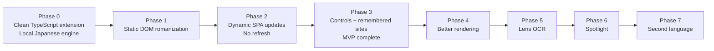

# Breaking the Barrier — Implementation Phases

- **Planning bootstrap:** Complete
- **Current implementation phase:** Phase 3 — in progress
- **Next phase:** Phase 3 final release gates
- **Last updated:** 2026-09-05

## 1. Roadmap principles

- Prove the DOM thesis before OCR.
- Keep V2 browser-native: TypeScript/JavaScript and browser APIs only, with no Python or local service in development or production.
- Keep every phase shippable to a developer build with explicit limitations.
- Treat restoration, privacy, and performance as foundational behavior, not polish.
- Use stable local fixtures for release gates; use real production sites as smoke tests unless product scope explicitly makes them contractual.
- Do not begin a later phase because it is visually exciting while an earlier acceptance criterion is failing.
- Update this file only after the stated acceptance criteria have actually been verified.

## 2. Definition of done for any phase

A phase is complete only when:

- all required deliverables exist;
- acceptance criteria pass;
- required automated tests pass;
- relevant manual browser checks are recorded;
- typecheck, lint, and build verification pass;
- permissions and privacy flows remain consistent with `Architecture.md`;
- documentation and `Memory.md` reflect the verified state;
- known incomplete or intentionally deferred items are explicit.

A passing compilation or a demonstration on one page is not phase completion.

## 3. MVP critical path

The milestone sequence is intentionally simple. The detailed criteria below are safety and verification guardrails, not additional product systems.



## Phase 0 — Repository modernization and architecture spikes (complete)

**Completed:** 2026-08-26

**Final gate:** Lindera 5.3.0, IPADIC 5.3.0, and WanaKana 5.3.1 are approved.
The original less-than-150 MiB loaded-memory target failed; the evidence-backed
initial Japanese processor exception is at most 180 MiB incremental Linux PSS.
Five final Chromium 151/Linux runs measured 158.5–160.4 MiB steady and
159.7–171.7 MiB peak, while explicit unload reclaimed 143.5–143.9 MiB. Package,
quality, cold/warm latency, CSP, offline, provenance, boundary, teardown, and
distribution checks passed. Phase 1 subsequently completed without changing
the accepted engine decision.

### Objective

Create a minimal, testable Manifest V3 TypeScript foundation from scratch while keeping the archived V1 prototype inert. Resolve the highest-risk Japanese-engine, package, worker, CSP, and local-asset assumptions before building the DOM product around them. Phase 0 must use no Python, Flask, native daemon, native messaging, local service, or runtime network dependency.

### Dependencies

- The five planning documents in the project root.
- Archived prototype and Git history for evidence only, never as an implementation dependency.
- Current official Chrome, Lindera, WanaKana, and dependency documentation.

### Scope

- Preserve the completed `legacy/prototype-2024/` archive and its boundary README without importing or executing it.
- Create `Memory.md` using the template in `Rules.md` because implementation begins here.
- Scaffold npm, strict TypeScript, Vite, Vitest/jsdom, Playwright, ESLint, and build verification.
- Produce an unpacked Chromium Manifest V3 extension with only planned MVP permissions.
- Create typed shared messages, error primitives, configuration, and the narrow browser API adapter.
- Create a static offscreen document and Japanese worker proof.
- Reproducibly acquire and verify one pinned official IPADIC release for development/build assets.
- Spike Lindera WASM in the offscreen worker and WanaKana behind a small `ascii-hepburn-v1` adapter.
- Build the first Japanese quality corpus, including the motivating examples, mixed text, particles, names, and unknown terms.
- Measure package size, installed assets, cold readiness, warm throughput, peak/steady memory, offline behavior, and CSP/store packaging constraints.
- Compare Lindera and Kuroshiro/Kuromoji against the same manually verified golden Japanese corpus. The corpus is the authority; candidate agreement and V1 behavior are not correctness oracles.

The initial authoritative corpus includes at least:

```json
[
  { "source": "星座になれたら", "expected": "seiza ni naretara", "category": "song-title" },
  { "source": "愛してる", "expected": "aishiteru", "category": "common-expression" },
  { "source": "東京", "expected": "toukyou", "category": "common-vocabulary" }
]
```

### Likely files and components

- `package.json`, `package-lock.json`, `tsconfig.json`, `vite.config.ts`, `manifest.json`.
- `src/background/service-worker.ts`.
- `src/processor/offscreen.html`, `offscreen.ts`, `japanese.worker.ts`.
- `src/shared/messages.ts`, `validation.ts`, `errors.ts`, `config.ts`.
- `src/platform/browser.ts`.
- `src/engines/contracts.ts` and `src/engines/japanese/*` spike modules.
- `scripts/prepare-ipadic.mjs`, `scripts/verify-dist.mjs`.
- `assets/dictionaries/ipadic/`, `third_party/licenses/`.
- `tests/corpus/japanese/`, `tests/unit/`, `tests/integration/`.
- `legacy/prototype-2024/README.md` (already present and inert) and `Memory.md`.

### Deliverables

- Reproducible install, typecheck, test, build, and unpacked-extension commands.
- A modern built extension that opens a minimal status popup and can start an offscreen worker without touching page content.
- A versioned generic engine contract.
- A Japanese spike report committed to `Memory.md` or a concise Phase 0 section in `Architecture.md` with exact tested versions and measurements.
- A checksum-verified local dictionary asset process and complete third-party notices.
- A go/no-go decision for Lindera/WanaKana.
- An active build, test, benchmark, and release workflow containing no Python, Flask, native service, or native messaging dependency.

### Acceptance criteria

- The built extension loads in current Chrome with no manifest or CSP errors.
- No persistent `<all_urls>` permission appears in the built manifest.
- The worker starts from packaged files while the network is offline.
- `星座になれたら` targets `seiza ni naretara`; `愛してる` targets `aishiteru`; deterministic Kana cases and selected mixed cases match the first golden corpus.
- An explicitly unknown Han-bearing token remains original rather than receiving a fabricated character reading.
- Engine results include source-aligned segments and version metadata.
- Dictionary provenance, checksum, and notices are reproducible.
- Real measurements are recorded against the PRD budgets: compressed assets, cold readiness, warm 100-string batch, and peak/steady memory.
- The selected engine meets the budgets or a documented, product-approved exception/fallback decision updates `Architecture.md` before Phase 1.
- The built artifact contains no remote executable URL or runtime dictionary/model download.
- The active source, tooling, tests, benchmarks, and built artifact use no Python, Flask, native daemon, native messaging, or local service.
- Existing prototype history remains accessible but inert under `legacy/`, and nothing outside the archive imports or invokes it.

### Required tests

- Typecheck and lint.
- Build and distribution verifier.
- Message-schema boundary tests.
- Japanese adapter/token schema tests.
- Byte-to-UTF-16 offset tests with emoji/supplementary characters.
- ASCII Hepburn and spacing golden tests.
- Offline Chromium worker smoke test.
- Asset checksum and license-notice verification.
- Repository and distribution boundary check that rejects active references to Python services or files under `legacy/`.

### Explicitly out of scope

- Scanning or changing webpage text.
- MutationObserver behavior.
- User preferences beyond scaffold defaults.
- Lens, OCR, Spotlight, additional languages, and Firefox.
- Polished popup design.

### Decision gate

Do not begin Phase 1 until the Japanese engine path has a measured go decision. If Lindera fails, evaluate the smallest credible local alternative through the existing engine contract. Do not solve a failed local spike by silently introducing a server.

## Phase 1 — Static Japanese DOM transliteration (complete + hardened)

**Completed:** 2026-08-26

**Final gate:** The packaged extension now injects one idempotent main-frame
controller after a user action, scans eligible static text in bounded slices,
romanizes Japanese locally, preserves mixed and excluded content, and restores
still-owned `Text.data` exactly. Stale and in-flight results are rejected,
individual failures remain original, and processor sessions are released only
when no tracked active tab remains. The 5,000-node Chromium fixture measured
3.4 MiB retained renderer growth, 20.6 MiB aggregate PSS movement, and zero
observed long tasks over 50 ms. The hardening fixture also covers numeric
context, extended Katakana, direct Hiragana phonetics, unknown compounds, and
ASCII/Japanese inline boundaries.

### Objective

Prove that a user can invoke the extension on a static page and receive correct, local, reversible Japanese romanization without OCR or a server.

### Dependencies

- Phase 0 accepted engine and worker architecture.
- Generic engine request/result contracts.
- Working unpacked extension and test harness.

### Scope

- Idempotent content-script injection into the current main frame after a user action.
- Frame controller state machine for Original, Inspecting, Starting, Active, Degraded, and Stopping.
- `TreeWalker` text-node collection in bounded slices.
- Structural, semantic, script, and initial visibility filtering.
- Script run analysis and conservative Japanese language evidence.
- Batched local engine client with cache keys and in-flight coalescing.
- Replace renderer using `Text.data` only.
- WeakMap node state, iterable active-node set, source/revision ownership, and internal restoration.
- Session epoch and stale-result validation even though dynamic observation is not enabled yet.
- A developer-facing start/stop control through the minimal popup.

### Likely files and components

- `src/content/bootstrap.ts`, `controller.ts`, `scanner.ts`, `node-state.ts`, `scheduler.ts`.
- `src/detector/scripts.ts`, `language-evidence.ts`.
- `src/engines/registry.ts` and engine client.
- `src/renderers/contracts.ts`, `replace.ts`.
- `src/shared/lru.ts`.
- `src/ui/popup/*` minimal controls.
- `tests/dom/static-*`, `tests/fixtures/pages/static-article.html`.

### Deliverables

- Static article conversion on user invocation.
- Exact programmatic restoration without page reload.
- Mixed-text preservation and excluded-element policy.
- Safe degraded status for unsupported pages and engine failure.

### Acceptance criteria

- Japanese paragraphs in a normal HTML fixture romanize locally.
- Mixed English/Japanese source preserves English, numbers, punctuation, emoji, and meaningful whitespace.
- `SCRIPT`, `STYLE`, code/pre, form controls, contenteditable, SVG, MathML, extension UI, and ignore regions remain untouched.
- Direct parent elements, attributes, event listeners, and framework handlers are not replaced.
- Stop restores every still-owned text node to its exact original string.
- If the page writes a newer value before restore, the extension does not overwrite it with a stale source.
- Turning off while requests are in flight does not apply late results.
- One engine item failure leaves that node original and does not prevent other nodes from rendering.
- The initial scan yields between bounded slices and produces no over-budget long task in the static large-page fixture.

### Required tests

- Unit tests for scanner eligibility and language evidence.
- DOM tests for static, nested, mixed, excluded, unsupported, and extension-owned UI.
- DOM tests for stale results, failure isolation, and exact restoration.
- Chromium integration test for injection, local processing, visible output, and stop.
- Performance test for a 5,000-node static fixture.
- Offline/network inspection test.

### Explicitly out of scope

- DOM mutation observation.
- Automatic site prompts or remembered-site access.
- Per-site preferences.
- Hover, Learning, ruby, OCR, Spotlight, frames beyond the main frame, and Shadow DOM.
- Production-site guarantees.

### What Phase 1 proves

Phase 1 proves the local Japanese engine, script/evidence boundary, safe static
DOM selection, Replace renderer, stale-result guard, and exact restoration.

## Phase 2 — Dynamic DOM observation

**Completed:** 2026-08-26

**Final gate:** The packaged controller installs its observer before the initial
scan, processes only changed nodes and added subtrees through bounded drains,
filters its own renderer writes, reconciles same-node and replacement updates,
cleans removals, and restores the latest page-authored values. The dynamic
fixture covers lyric transitions, history-state changes, subtree insertion,
replacement, exclusions, and a 1,000-node mutation burst measured at 207 ms
with zero observed long tasks. Phase 3 has not begun.

### Objective

Prove the core product thesis on modern applications: Japanese text that changes or appears after load is romanized automatically without reload, periodic full-page scanning, observer loops, or stale writes.

### Dependencies

- Phase 1 scanner, node state, renderer, engine client, restoration, and fixtures.

### Scope

- Install `MutationObserver` before initial scan.
- Observe `childList`, `characterData`, and `subtree` on the document root.
- Deduplicate changed nodes and added subtrees.
- Process mutation work in bounded scheduled drains.
- Detect extension-authored writes through expected rendered values.
- Reclassify framework-authored same-node updates as new source revisions.
- Scan replacement/added nodes as new sources.
- Cancel or discard stale asynchronous results.
- Clean removed/disconnected nodes from active ownership sets.
- Add diagnostic content-free counters for mutation rate, affected nodes, batches, cache hits, and timings.
- Evaluate a narrow `lang`/hidden attribute strategy; do not enable noisy class/style observation without evidence.

### Likely files and components

- `src/content/controller.ts`, `node-state.ts`, `scanner.ts`, and
  `scheduler.ts`.
- `src/renderers/replace.ts` boundary-neighbor expansion for dynamic updates.
- Spotify-like lyric, React-style replacement, exclusion, and mutation-stress
  fixtures.

### Deliverables

- Stable event-driven update pipeline.
- Self-mutation prevention and framework reconciliation.
- Dynamic restoration behavior.
- Measured performance on large and mutation-heavy fixtures.

### Acceptance criteria

- **Critical milestone:** A Spotify-like fixture changes Japanese lyric text dynamically and the romanized output updates automatically without page reload.
- A YouTube-like fixture inserts a title/comments and performs History API navigation; new content is processed while unaffected nodes are not rescanned.
- A same-node React-like overwrite becomes the new source and is romanized.
- A React-like node replacement removes old ownership and processes the new node.
- Extension writes produce observer records but no infinite loop or repeated engine request.
- Multiple records for one node result in one current processing request per drain.
- A result for revision N cannot overwrite revision N+1.
- Removed nodes do not accumulate in the active ownership set after repeated replacement stress.
- Toggle-off during rapid mutation restores current originals or respects newer page values.
- The observer and warm-update budgets in `PRD.md` pass on the reference fixtures.
- No recurring whole-document rescan appears in normal diagnostics.

### Required tests

- DOM tests for added subtrees, character data, record deduplication, self writes, stale responses, removed nodes, and partial failures.
- Chromium tests for Spotify-like and YouTube-like fixtures.
- React-style same-node and replacement integration tests.
- 5,000-node initial scan plus high-frequency mutation performance tests.
- Repeated enable/disable test proving a single controller and observer.
- Memory/leak-oriented detached-node stress check.

### Explicitly out of scope

- Persistent per-site permissions and polished detection prompt.
- Class/style attribute observation unless the phase experiment justifies a narrow implementation.
- Open Shadow DOM and broad iframe support.
- Alternate renderers, OCR, and site-specific adapters.

### Stop condition

Do not proceed to user-facing persistence until the critical Spotify-like fixture, React reconciliation, loop prevention, restoration, and performance gates pass together.

## Phase 3 — MVP controls, prompt, restoration UX, and preferences

**Started:** 2026-09-05

**Verified progress:** The versioned `storage.local` preference foundation is
implemented with privacy-safe defaults, a pure legacy migration, canonical
HTTP(S)-origin keys, serialized patches, storage-change publication, and
future-schema protection. The popup now derives explicit Original, Starting,
On, Partial, and Unavailable views from the typed current-frame summary and
offers a current-origin-only remembered-site control with local-processing
copy. Deterministically hashed programmatic registrations reconcile on install,
startup, permission changes, and preference changes; missing permission removes
stale policy and registration. Authorized `ask` pages now use an engine-free
text/subtree detector and a marked, non-modal Shadow-root prompt; authorized
`always` pages enter the existing controller directly. Typed service-worker
handshakes revalidate sender origin, stored policy, feature flags, and actual
permission before either path. Ephemeral remembered-frame ownership lets
preference or permission deactivation dismiss pending UI and restore active
text exactly. Grant, denial, rollback, forget, idempotence, repair, prompt,
detection, and revocation paths have deterministic coverage, while packaged
Chromium covers the available UI, missing-permission boundary, and live
deactivation restore. Headless Chromium cannot accept its own optional-host
confirmation prompt, so a real grant remains a manual-browser gate. The popup
now exposes Ask first versus Romanize automatically only after access is saved;
changing that policy does not request permission again. Axe checks cover the
packaged popup and open Shadow prompt, while packaged interaction checks cover
keyboard order, forced colors, dark mode, reduced motion, and 200% layout.
Final manual/distribution gates remain, so Phase 3 is not yet a release
candidate.

### Objective

Turn the proven Live Mode engine into a coherent, privacy-explained MVP that users can control per page and per site.

### Dependencies

- Phase 2 dynamic pipeline and measured budgets.
- Finalized popup and page-prompt behavior from `Design.md`.

### Scope

- Popup current-tab status and primary Original/Romanize toggle.
- Japanese detection status and “Romanize this page?” confirmation.
- Non-modal in-page detection chip on already authorized sites.
- Clear engine-loading, active, partial, unsupported, restricted, and retry states.
- `chrome.storage.local` versioned preference schema and migrations.
- Global default, Japanese enabled flag, fixed Replace mode, and ASCII Hepburn policy.
- Per-origin ask/always/disabled policy.
- Optional origin request in a user gesture and persistent programmatic content-script registrations.
- Registration reconciliation after browser/extension restart and permission changes.
- Permission-revocation handling and exact live restoration.
- Top-frame page UI in a marked Shadow root.
- Popup/in-page accessibility, keyboard, reduced motion, light/dark theme, and privacy copy.
- Distribution manifest/privacy review.

### Likely files and components

- `src/ui/popup/*`, `src/ui/in-page/*`.
- `src/storage/schema.ts`, `migrations.ts`, `preferences.ts`.
- `src/background/registrations.ts`, permission handling, status routing.
- `src/content/controller.ts` status and top-frame UI integration.
- Design tokens and icons.
- Permission, migration, accessibility, and restart fixtures.

### Deliverables

- Complete Live Mode MVP user flow.
- Remembered-site access without install-time all-sites permission.
- Exact visible toggle and restoration states.
- Local-only privacy disclosure and restricted-page behavior.
- Release-candidate Chrome package and MVP manual test checklist.

### Acceptance criteria

- On a new site, the extension does not inspect content before a user invocation.
- The popup reports Japanese detection and requires confirmation before the first change.
- “Remember for this site” explains and requests only the current origin.
- A remembered site can inspect/prompt or auto-enable according to policy after a new document loads.
- Disabling a site unregisters persistent injection and removes/revokes access as designed.
- Service-worker restart does not duplicate or lose registrations; stored policy and actual permission are reconciled.
- Toggle-off visibly restores the exact latest originals without reload.
- Restricted browser pages show an unavailable explanation rather than an error loop.
- The popup and page chip are keyboard operable, have visible focus, pass automated accessibility checks, and honor reduced motion.
- Extension UI is never processed by Live Mode.
- The built manifest contains only the planned permissions and optional host patterns.
- No page content, paths, titles, or caches are persisted.
- All Phase 1 and Phase 2 acceptance suites remain green.

### Required tests

- Preference defaults, migrations, and storage-change tests.
- Permission request/grant/deny/revoke tests where automation supports them.
- Registration reconciliation and idempotence tests.
- Popup and in-page UI unit/accessibility tests.
- Chromium end-to-end flows for first use, remember site, restart, disable, and restricted URL.
- Manual high contrast, keyboard-only, 200% zoom, screen-reader prompt, and real production-site smoke tests.
- Final offline and network-inspection test.

### Explicitly out of scope

- Hover or Learning renderer.
- OCR Lens and Spotlight.
- User accounts, sync, telemetry, and translation.
- Guaranteed Firefox packaging.
- Perfect production-site coverage or site-specific scraping.

### MVP milestone

Phase 3 completion is the Live Mode MVP release candidate defined by `PRD.md`.

## Phase 4 — Renderer, accessibility, frame, and Shadow DOM hardening

### Objective

Expand how users can view readings and improve coverage only after the default Replace experience is stable.

### Dependencies

- Released or release-ready Phase 3 MVP.
- Collected layout/accessibility feedback and real-site failures.

### Scope

- Formalize renderer switching and restore across mode changes.
- Implement Hover Mode with mouse and keyboard focus behavior.
- Prototype Learning/ruby annotation behind an experimental flag.
- Test copy/paste, selection, line height, wrapping, vertical text, and screen readers.
- Add same-origin/all-authorized-frame support if permission and restoration tests pass.
- Add best-effort open Shadow root discovery/observation through `RootRegistry`.
- Improve visibility behavior based on Phase 2 evidence.
- Add site-specific compatibility shims only for documented generic-engine gaps, behind narrow adapters.

### Likely files and components

- `src/renderers/hover.ts`, `learning.ts`.
- Renderer preference and switching logic.
- `src/content/roots.ts` and frame coordination.
- UI tooltip/annotation styles and accessibility tests.
- Shadow/frame/layout fixtures.

### Deliverables

- Stable Hover Mode.
- Evidence-backed decision to ship, revise, or defer Learning Mode.
- Measured same-origin frame and open Shadow DOM coverage.
- Compatibility guidance for known layout classes of failure.

### Acceptance criteria

- Switching renderer restores prior renderer artifacts exactly before applying the next view.
- Hover leaves source text unchanged and works by pointer and keyboard focus.
- Tooltip positioning updates/dismisses on scroll, resize, navigation, and target removal.
- Hover and any learning prototype do not create duplicate screen-reader output in the tested policy.
- Ruby/annotation ships only if line-height, clipping, selection, React rerender, and restoration fixtures pass; otherwise the documented decision is to keep it experimental.
- Authorized frames restore independently and top-frame UI is not duplicated.
- Open Shadow roots process through the same generic pipeline; closed roots remain untouched.
- Phase 3 Replace Mode behavior and performance do not regress.

### Required tests

- Renderer contract and switching tests.
- Tooltip focus/pointer/geometry tests.
- Ruby layout and accessibility matrix if Learning Mode advances.
- Same-origin, cross-origin-unavailable, sandboxed frame tests.
- Open/closed and dynamically added Shadow root fixtures.
- Full MVP regression suite.

### Explicitly out of scope

- Main-world `attachShadow` patching.
- Forcing access to closed roots or unauthorized frames.
- OCR, Spotlight, and new languages.

## Phase 5 — Manual Lens / OCR overlay

### Objective

Add a privacy-preserving, user-invoked way to romanize Japanese text that exists only in visible pixels, without weakening Live Mode.

### Dependencies

- Stable detector, Japanese engine, messaging, top-frame overlay root, and permission model.
- Phase 5 OCR spike passes before product UI is completed.

### Scope

- Selected visible-region interaction.
- Hide extension overlay for capture.
- `captureVisibleTab` through `activeTab` after a user gesture.
- Robust CSS-viewport to screenshot-pixel geometry.
- Local image decode/crop in the offscreen processor.
- Evaluate Tesseract.js 7.x, bundled Japanese trained data, positional output, memory, worker reuse, and cancellation.
- Normalize OCR lines/words and boxes.
- Reuse script detection and Japanese transliteration for recognized strings.
- Fixed viewport overlay with original/romanized text and clear OCR uncertainty.
- Dismiss/invalidate on scroll, resize, zoom, navigation, or material movement.
- Blank/protected capture and OCR failure states.

### Likely files and components

- `src/lens/contracts.ts`, `geometry.ts`, `capture-state.ts`.
- `src/processor/ocr.worker.ts` and OCR lifecycle.
- `src/renderers/ocr-overlay.ts`.
- Service-worker capture handlers.
- Lens UI and `assets/ocr/`.
- `tests/ocr/` and image fixtures.

### Deliverables

- OCR spike report and dependency decision.
- Manual Japanese region capture with position-aware romanized overlays.
- OCR asset provenance and licenses.
- Performance/privacy explanation in product UI.

### Acceptance criteria

- OCR code/model data is absent from pre-Phase-5 builds and lazy-loaded only on Lens invocation in Phase 5 builds.
- All OCR code, WASM, and trained data are packaged and work offline.
- Selected-region mapping passes expected-box tolerances across tested device scale and browser zoom cases.
- Japanese image fixtures meet the phase's recorded text and position quality threshold.
- Worker reuse materially improves subsequent captures and does not show unbounded memory growth.
- Scroll, resize, zoom, navigation, and Escape invalidate or dismiss overlays.
- OCR confidence is not presented as reading confidence.
- Protected/blank capture produces an honest unavailable state.
- OCR failure leaves Live Mode active and unchanged.
- Network inspection finds no screenshot or OCR upload.

### Required tests

- Pure geometry and coordinate-space tests.
- OCR golden image/text/box tests.
- Worker load/reuse/cancel/restart tests.
- Chromium capture-to-overlay integration tests.
- Memory and latency benchmarks on reference hardware.
- Keyboard, focus, zoom, contrast, and reduced-motion checks.
- Full Live Mode regression suite.

### Explicitly out of scope

- Continuous scanning.
- Full-page stitched OCR.
- Persistent OCR history.
- Translation of OCR results.
- Protected-media workarounds.
- Automatic video subtitle tracking.

### Decision gate

If local Japanese OCR cannot meet useful quality and latency at an acceptable package/memory cost, keep Lens experimental or defer it. Do not replace it with silent cloud OCR.

## Phase 6 — Spotlight / Point-and-Read experiment

### Objective

Determine whether a deliberate, stationary-pointer OCR interaction is useful and practical under browser capture limits.

### Dependencies

- Phase 5 capture, crop, OCR, Japanese engine, overlay, and cancellation foundations.

### Scope

- Explicit Spotlight mode entry/exit.
- Pointer-motion state machine with stationary debounce and tolerance.
- Small crop around pointer.
- At most one active job and stale-result cancellation.
- Capture frequency materially below Chrome's two-per-second maximum.
- Compact contextual overlay and clear active cursor treatment.
- Usability/performance experiment on images, canvas apps, paused video, and moving content.

### Likely files and components

- `src/lens/spotlight-controller.ts`.
- Spotlight cursor/tooltip styles.
- Pointer/capture scheduler tests and experimental settings.

### Deliverables

- Opt-in experimental Spotlight build.
- Measured capture rate, latency, OCR hit rate, CPU/memory cost, and user feedback.
- Ship, redesign, or stop decision.

### Acceptance criteria

- No capture fires during ordinary pointer motion.
- One stationary pause produces at most one current result.
- Moving, scrolling, clicking, blurring the tab, pressing Escape, or exiting mode cancels/stales pending work and removes the overlay.
- Capture frequency never exceeds the configured safe limit or browser maximum.
- Only the cropped region reaches OCR.
- Live Mode and page interaction remain usable while Spotlight is armed.
- Protected, animated, or low-confidence content fails gracefully.

### Required tests

- Deterministic pointer state-machine tests.
- Capture throttle and cancellation tests.
- Chromium interaction tests on static image, canvas, paused video fixture, and moving content.
- Performance and battery/CPU observation.
- Accessibility and reduced-motion review.

### Explicitly out of scope

- Invisible always-on Spotlight.
- Continuous full-frame OCR.
- Media capture streams without a new permission/privacy decision.
- Claims of support for DRM/protected video.

## Phase 7 — Second language module

### Objective

Prove that the architecture is language-agnostic by adding one real language without changing DOM traversal, mutation ownership, restoration, processor messaging, or renderer contracts.

### Dependencies

- Stable generic engine contract and one mature Japanese production path.
- User research selecting the next language and romanization convention.

### Scope

- Select the language from product demand and technical research. Korean is the current candidate because it matches the media persona, but it is not preselected.
- Document script-versus-language ambiguity and contextual reading needs.
- Add a language engine, dictionary/model assets if required, formatting policy, settings, corpus, and license provenance.
- Extend engine registry and page detection.
- Keep language assets independently lazy.
- Verify mixed pages containing Japanese, the second language, and Latin text.

### Likely files and components

- `src/engines/<language>/`.
- Engine registry metadata.
- Detector/evidence additions that remain generic.
- Per-language settings and corpus fixtures.
- Processor lazy-worker or shared-worker changes based on measured memory.

### Deliverables

- Second engine and versioned output policy.
- Language-specific PRD/architecture decision update.
- Proof that DOM/rendering modules required no language-specific branch beyond registry/configuration.

### Acceptance criteria

- New language output meets its owned golden corpus and documented unknown policy.
- Japanese behavior remains unchanged.
- A mixed Japanese/second-language page selects and processes appropriate runs without corrupting either.
- The second engine can be enabled/disabled and loaded independently.
- DOM controller, mutation queue, node state, and Replace renderer contain no new language-specific imports or selectors.
- Package, memory, startup, license, privacy, and permission impact is measured and accepted.

### Required tests

- Script and language evidence cases for the new language.
- Language engine and output-policy corpus.
- Mixed-language DOM/integration fixtures.
- Lazy-loading and cache-key separation tests.
- Full Japanese regression suite.

### Explicitly out of scope

- Adding several languages at once.
- Pretending deterministic character mapping is adequate when the selected language needs context.
- Translation or definitions.

## Phase 8 — Advanced dynamic media experiments

### Objective

Explore high-cost media cases only after Live Mode, Lens, and language modularity are proven.

### Dependencies

- Evidence that users value Lens/Spotlight enough to justify broader capture complexity.
- Separate privacy, permission, performance, and store-policy review.

### Scope

- Select one bounded experiment with a written hypothesis and stop rule.
- Reuse the existing capture, language, renderer, and privacy boundaries rather than creating a parallel media product.
- Measure value, correctness, geometry stability, CPU, memory, capture frequency, battery impact, and permission cost.
- Keep the experiment off by default and isolated from Live Mode.
- Promote an experiment only after updating the product, architecture, rules, phase plan, and design states that it affects.

### Candidate experiments

- Tracking OCR overlays across short intervals on non-protected paused or slow-changing media.
- Image-element anchoring that survives normal page scroll and resize.
- Canvas-region refresh initiated by the user.
- User correction or temporary custom readings for names.
- More capable local OCR or stable browser-native on-device OCR if official support exists.
- Full-page or document-specific OCR only with clear bounded interaction.

### Likely files and components

- A narrowly named controller under `src/lens/` or `src/media/` for the selected experiment.
- Existing capture, processor, OCR, engine, geometry, and overlay modules through their public contracts.
- An experimental preference/feature gate and clear in-product label.
- Dedicated fixtures under `tests/fixtures/pages/` and measurements under `tests/performance/` or `tests/ocr/`.
- Updated privacy/permission disclosures if the selected experiment changes them.

### Deliverables

- One experiment at a time, each with a hypothesis, prototype, measurement, and stop rule.
- Updated architecture and privacy decision before any experiment becomes a product feature.

### Acceptance criteria

- The experiment demonstrates material user value over manual Lens.
- CPU, memory, capture frequency, and battery cost are acceptable and visible.
- Permissions and privacy remain proportional and understandable.
- Protected content is not bypassed.
- Failure and stale geometry cannot leave misleading overlays.
- The feature remains optional and does not degrade Live Mode.

### Required tests

- Experiment-specific correctness, cancellation, privacy, geometry, and performance tests.
- Full regression suite for Live Mode, Lens, and supported languages.

### Explicitly out of scope

- Shipping all candidate experiments.
- DRM bypass, hidden capture, or recording without explicit user awareness.
- Cloud AI introduced as a shortcut for local performance or accuracy gaps.

## Roadmap maintenance

When a phase advances, update its header and add a concise status block near the top of this file:

```text
Current implementation phase: Phase N
Current milestone: ...
Last verified: YYYY-MM-DD — command/check summary
Blocked/at risk: ...
```

Detailed transient handoff belongs in `Memory.md`. Acceptance criteria remain in this file and should not be rewritten merely to match an incomplete implementation.
